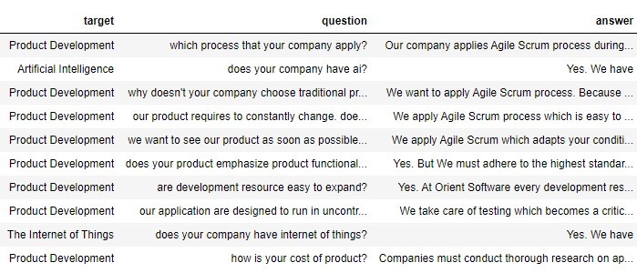
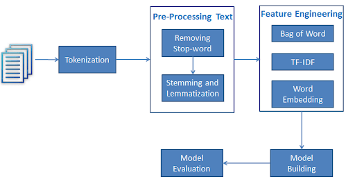
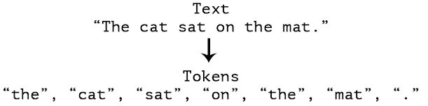
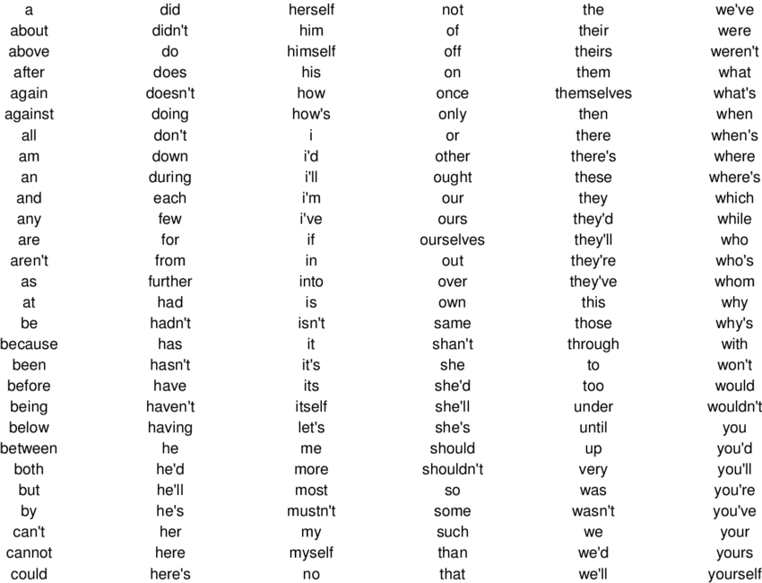

Sample research - Bag of words for Chatbot
=====================

Chatbot - Machine Learning Only based
---------------------

*The research aims to achieve basic knowledge about NLP*

.. note::

    This research use Python with Scikit-learn library to complete.

Overview
---------------------

NLP is a field in machine learning with the ability of a computer to understand, analyze, manipulate, and potentially generate human language. 
In the first steps of NLP, simple ways are used to convert sentences into vectors.

Data
---------------------

Data in this research includes target(label), question and answer.

Data is the Frequently Asked Question (FAQ) about Orient Software.

Method
---------------------

In this research, some basic processes and methods are used to convert sentences into vectors.

Pipeline of the methods is as flow

* **Convert sentences into tokenizers**:

Tokenizers is the meaningful tokens of a sentence.

*Remove stop words (optional)*

To make the tokenizers more meaningful, stop words can be from tokenizers. Stop words
is the common words that usually do not mean in the sentence. Samples of English stop words is listed bellow.

*n-grams (optional)*

n-grams is used to take more input information with not only tokenizers but also phrase.

.. image:: images/ngrams.png
  :width: 400
  :alt: Sample of English stop words.

* **Apply bag of words for tokenizers**:

Bag of words is the method to change the sentences into vectors.

First, declare the vocabulary vectors, that includes all distinct tokens in all documents.

From the tokens of a sentence, we can use vocabulary vectors to turn it to the vectors.

.. note::

    If the input sentences contains the token not in vocabulary, the current methods treats that input as none.

* **TF-IDF**:

TF-IDF stands for “Term Frequency — Inverse Document Frequency”. 
This is a technique to quantify a word in documents, we generally compute a weight 
to each word which signifies the importance of the word in the document and corpus. 
This method is a widely used technique in Information Retrieval and Text Mining.

As we use TF-IDF, we can find the words that not important in a whole document.

More about TF-IDF: https://towardsdatascience.com/tf-idf-for-document-ranking-from-scratch-in-python-on-real-world-dataset-796d339a4089

* **Classification**:

For classification, simple machine learning models are tested to classify the bag of words vectors.

Result
---------------------

Results are shown here

Evaluation
---------------------

Confusion matrix

